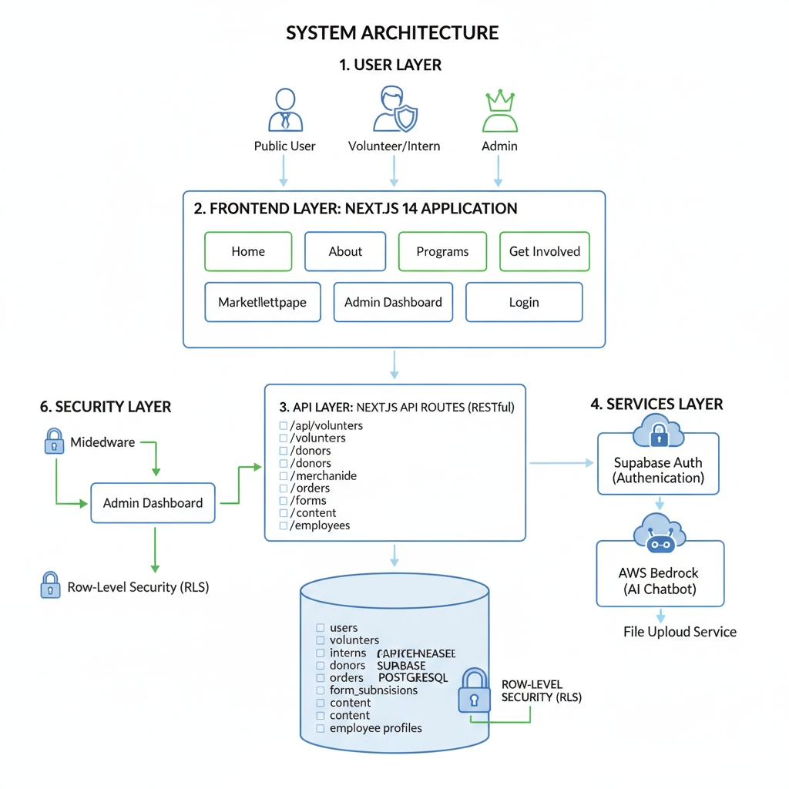
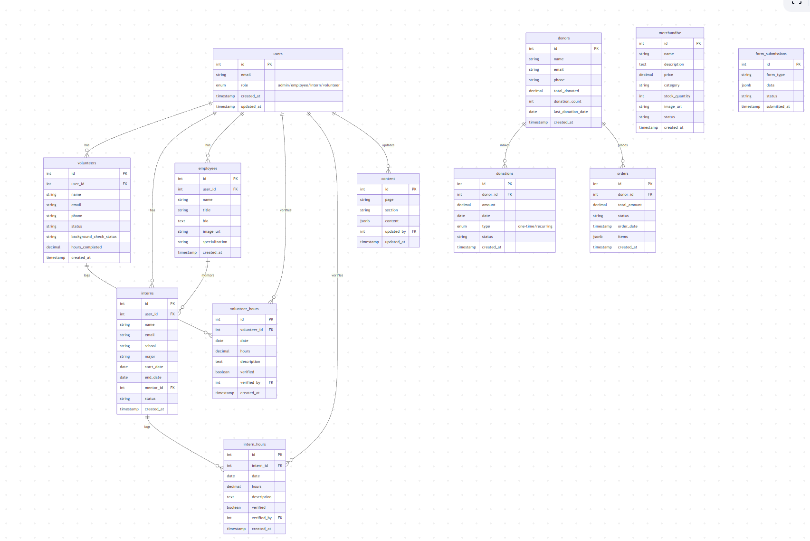
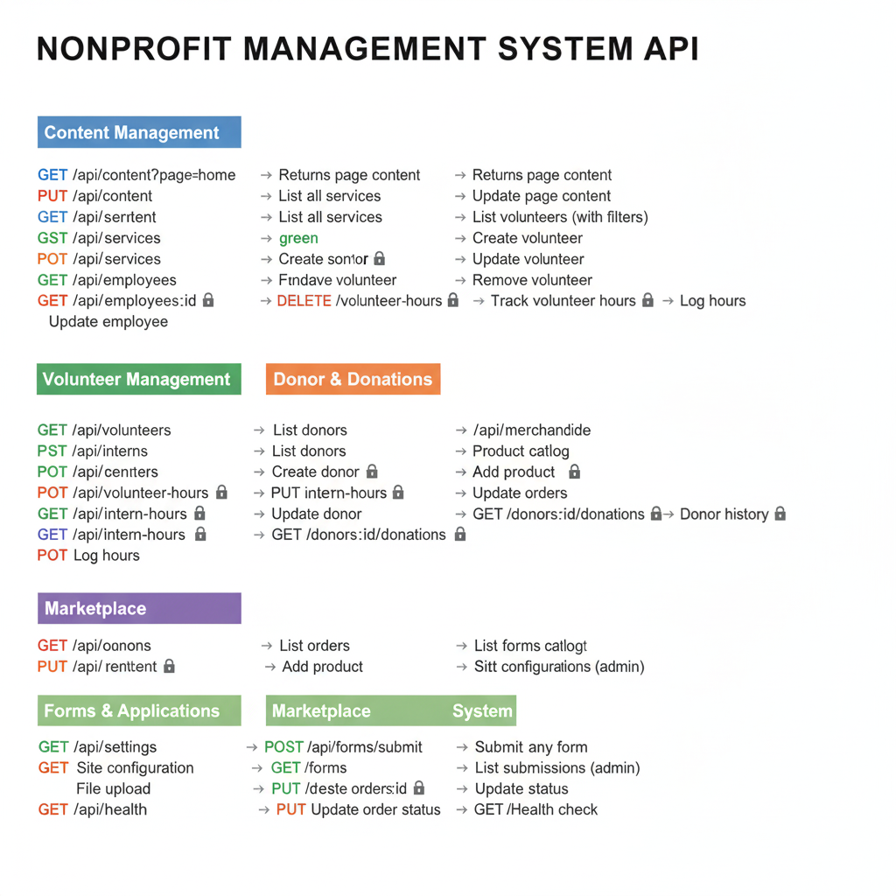

## Team Loop IT

## About NPO - Neurologic Music Therapy Services of Arizona (NMTSA)
- [About NMTSA](https://www.nmtsa.org/)

## Introduction
The Neurologic Music Therapy Services of Arizona (NMTSA) Website is a comprehensive digital platform designed to transform how the organization manages its operations and connects with its community. NMTSA provides specialized music therapy services for individuals with neurological conditions, and this platform empowers them to streamline volunteer management, donor tracking, internship programs, merchandise sales, and content management—all while showcasing their mission to transform lives through music and neuroscience.

This solution reduces administrative overhead by providing an intuitive admin dashboard, automated form submissions, secure role-based access, and a modern public-facing website that properly represents NMTSA's life-changing work.

## Quick Preview
1. [Live Demo](https://loop-it-nmtsa-website.vercel.app)
2. [4-minute Quick Demo Video](https://youtu.be/MNueC1TDn28)

## Technologies Used 
| Purpose | Technologies |
| --- | --- |
| Frontend Framework | Next.js 14, React 18, TypeScript |
| Styling | Tailwind CSS, Framer Motion |
| Form Management | React Hook Form, Zod Validation |
| Backend API | Next.js API Routes (RESTful) |
| Database | Supabase (PostgreSQL) |
| Authentication | Supabase Auth with Row-Level Security |
| AI Integration | AWS Bedrock (Chatbot) |
| Deployment | Vercel |
| Version Control | Git, GitHub |

## Overall Architecture

---

## Database Schema

---

## REST APIs

---

## Key Features

### Public Website
- **Modern Design:** Fully responsive, accessible interface built with Next.js and Tailwind CSS
- **Service Showcase:** Detailed program information including Music Therapy, Professional Development, Music Lessons
- **About Page:** Mission, team profiles, impact stories
- **Get Involved:** Interactive cards for Volunteer, Intern, and Employment opportunities
- **Marketplace:** Browse and purchase NMTSA merchandise with shopping cart
- **Blog:** Latest news and updates from NMTSA

### Admin Dashboard
- **Role-Based Access Control:** Secure authentication with admin, employee, intern, and volunteer roles
- **Dashboard Stats:** Real-time analytics on volunteers, interns, donors, orders, and revenue
- **Content Management:** Easy editing of website content without code changes
- **User Management:** Manage all users, roles, and permissions from one place

### Volunteer Management
- Volunteer application forms with validation
- Profile management (contact info, skills, availability)
- Hours tracking and verification system
- Background check status tracking
- Activity history and impact metrics

### Intern Management
- Comprehensive internship application forms
- Intern profiles with academic information
- Mentor assignment and tracking
- Hours logging and verification
- Academic credit coordination

### Donor Management
- Donor profiles and contact management
- Donation tracking (one-time and recurring)
- Donation history and analytics
- Tax receipt tracking
- Donor engagement metrics

### Marketplace
- Product catalog with categories and filters
- Inventory management
- Shopping cart and checkout
- Order tracking and fulfillment
- Sales analytics

### Advanced Forms System
- **React Hook Form + Zod:** Type-safe validation with excellent UX
- **Modal-Based Interface:** Clean, non-intrusive form experience
- **Active Forms:**
  - Contact Form
  - Professional Consultation Request (Volunteer)
  - Internship Application (Multi-section with e-signature)
  - Donation Form
  - Service Request Forms
- **Features:**
  - Real-time validation
  - Conditional fields
  - Auto-save drafts (planned)
  - File uploads
  - Success/error feedback

### AI Chatbot
- AWS Bedrock integration for intelligent responses
- Context-aware assistance for visitors
- FAQ automation
- Application guidance

## Contributors

### Team Loop IT - 2025 Arizona Opportunity Hack

- **Kirtan Thummar** - Backend/AI Developer - [GitHub](https://github.com/VanGoghCode)
- **Smit Patel** - Frontend Developer - [GitHub](https://github.com/smit30patel)
- **Shubham Tiwari** - Project Manager - [GitHub](https://github.com/shubham17tiwari)

## Contact

- **Project Repository:** [GitHub](https://github.com/2025-Arizona-Opportunity-Hack/Loop-IT-NMTSAWebsite)
- **Nonprofit Partner:** [NMTSA](https://ohack.dev/nonprofit/coDhSpsyG5uqgpmm0SdS)
- **Hackathon:** [2025 Fall Opportunity Hack](https://www.ohack.dev/hack/2025_fall)
- **DevPost Submission:** [Submit here](https://devpost.com/software/nmtsa-website/)

## License

MIT License - feel free to use this project for learning or building similar solutions for nonprofits.

---

**Built with ❤️ for NMTSA by Team Loop IT during the 2025 Arizona Opportunity Hack**
